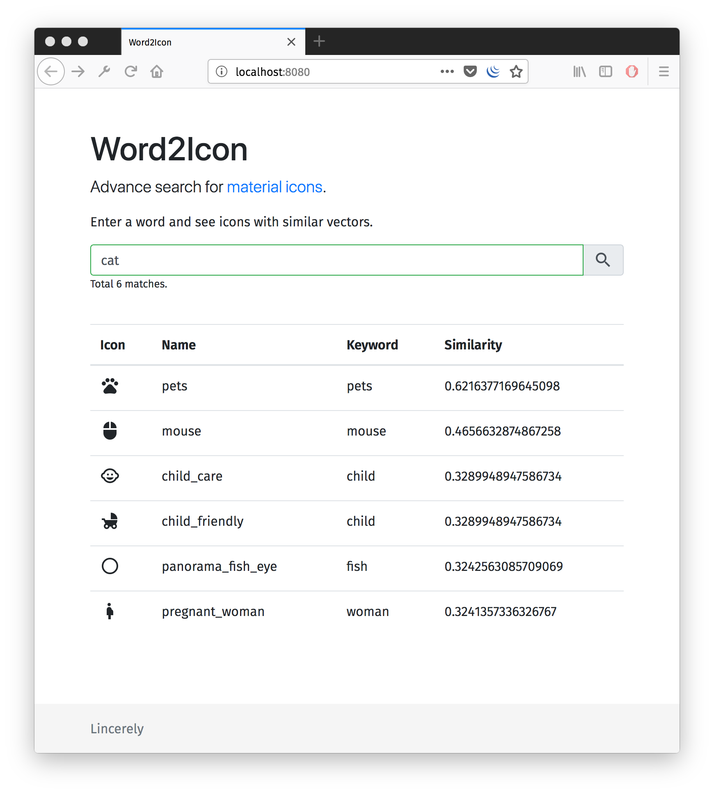

# Word2Icon

> Search material design icon with related words

## Why 

When searching for Material icon in https://material.io/tools/icons/, I always need to guess the name of the icon or skim through whole list of icons to find a suitable one.

Therefore, Word2Icon is created so that I can search icons with related keywords.

This is done by sorting icon using the similarities between the query and icon descriptions. While similarities are caluclated from trained vector from Word2Vec.

## Acknowledgement

This app is build on top of [turbomaze](https://github.com/turbomaze)'s [word2vecjson](https://github.com/turbomaze/word2vecjson).

## External links

 - Source of icon names used: https://raw.githubusercontent.com/google/material-design-icons/master/iconfont/codepoints
